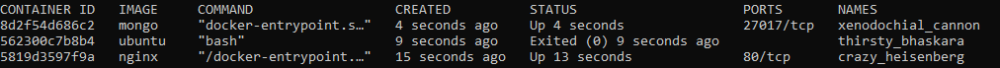
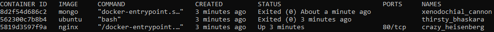

## Exercise 1.1: Getting started

Since we already did "Hello, World!" in the material let's do something else.
Start 3 containers from image that does not automatically exit, such as nginx, detached.
Stop 2 of the containers leaving 1 up.

Submit the output for docker ps -a which shows 2 stopped containers and one running.

&nbsp;

### Steps

- docker container run -d nginx
- docker container run -d ubuntu
- docker container run -d mongo
- docker container ls -a

### Results

### Steps

- docker container stop xenodochial_cannon
- docker container stop thirsty_bhaskara
- docker ps -a

### Results

