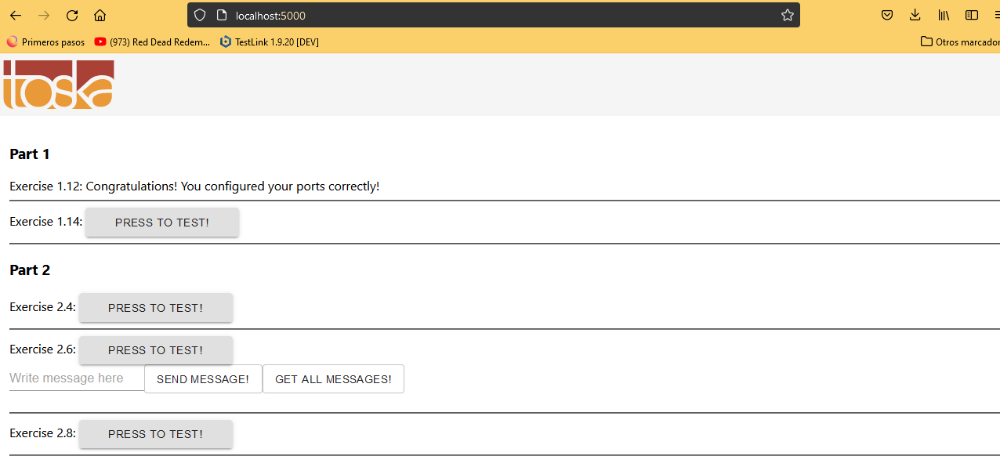

# Exercise 1.12: Hello, frontend!

This exercise is mandatory

A good developer creates well-written READMEs. Such that they can be used to create Dockerfiles with ease.

Clone, fork or download the project from https://github.com/docker-hy/material-applications/tree/main/example-frontend.

Create a Dockerfile for the project (example-frontend) and give a command so that the project runs in a docker container with port 5000 exposed and published so when you start the container and navigate to http://localhost:5000 you will see message if you're successful.

Submit the Dockerfile.

## Steps

- docker build . -t example-frontend
- docker run -p 5000:5000 example-frontend

## Results

