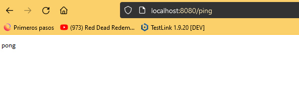

# Exercise 1.13: Hello, backend!

This exercise is mandatory

Clone, fork or download a project from https://github.com/docker-hy/material-applications/tree/main/example-backend.

Create a Dockerfile for the project (example-backend). Start the container with port 8080 published.

When you start the container and navigate to http://localhost:8080/ping you should get a "pong" as response.

Submit the Dockerfile and the command used.

Do not alter the code of the project

## Steps

- docker build . -t example-backend
- docker run -p 8080:8080 example-backend

## Results

