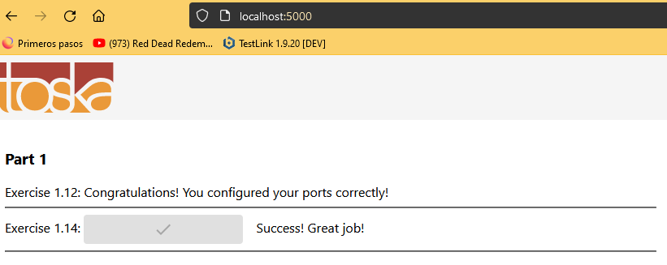

# Exercise 1.14: Environment

Start both frontend-example and backend-example with correct ports exposed and add ENV to Dockerfile with necessary information from both READMEs (front,back).

Ignore the backend configurations until frontend sends requests to _backend_url_/ping when you press the button.

You know that the configuration is ready when the button for 1.14 of frontend-example responds and turns green.

Do not alter the code of either project

Submit the edited Dockerfiles and commands used to run.

## Steps

- docker build . -t example-backend
- docker run -p 8080:8080 example-backend
- docker build . -t example-frontend
- docker run -p 5000:5000 example-frontend

## Results

