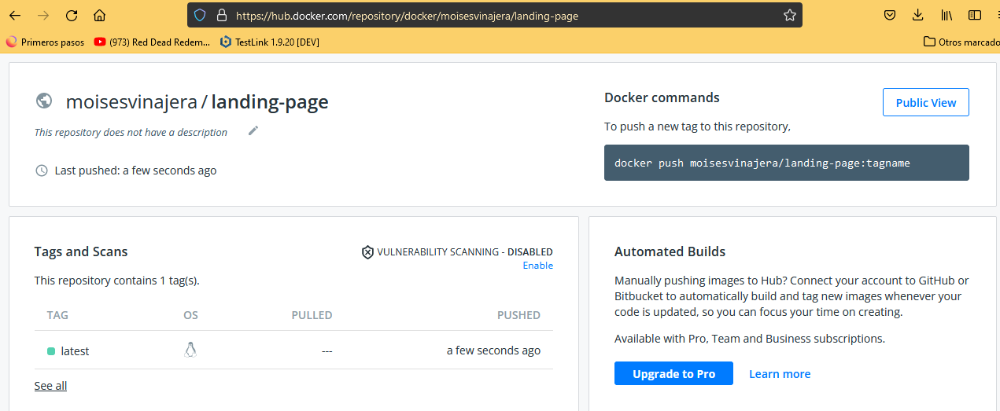
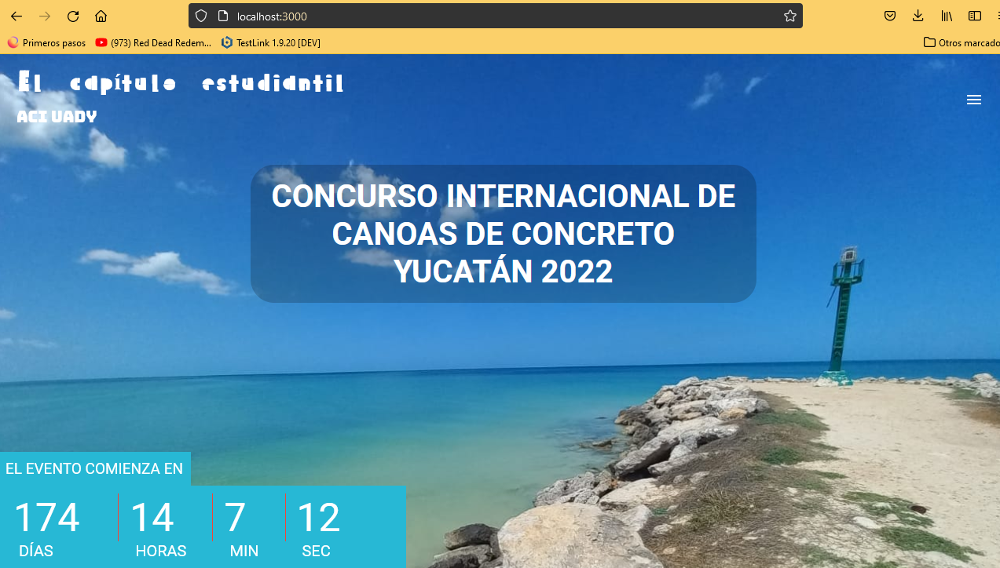

# Exercise 1.15: Homework

Create Dockerfile for an application or any other dockerised project in any of your own repositories and publish it to Docker Hub. This can be any project, except the clones or forks of backend-example or frontend-example.

For this exercise to be complete you have to provide the link to the project in Docker Hub, make sure you at least have a basic description and instructions for how to run the application in a README that's available through your submission.

## Steps

- docker build . -t landing-page
- docker run -p 3000:3000 landing-page
- docker login
- docker tag landing-page moisesvinajera/landing-page
- docker push moisesvinajera/landing-page

### link: https://hub.docker.com/repository/docker/moisesvinajera/landing-page

## Results

