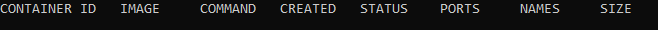

# Exercise 1.2: Cleanup

We've left containers and a image that won't be used anymore and are taking space, as docker ps -as and docker images will reveal.

Clean the docker daemon from all images and containers.
Submit the output for docker ps -a and docker images

## Before cleaning

### Steps

- docker ps -as

### Results

### Steps

- docker images

### Results

## Cleaning

### Steps

- docker container prune
- image rm mongo
- image rm nginx
- image rm ubuntu

## After cleaning

### Steps

- docker ps -as

### Results

### Steps

- docker images

### Results

