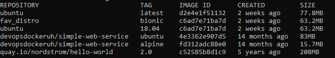
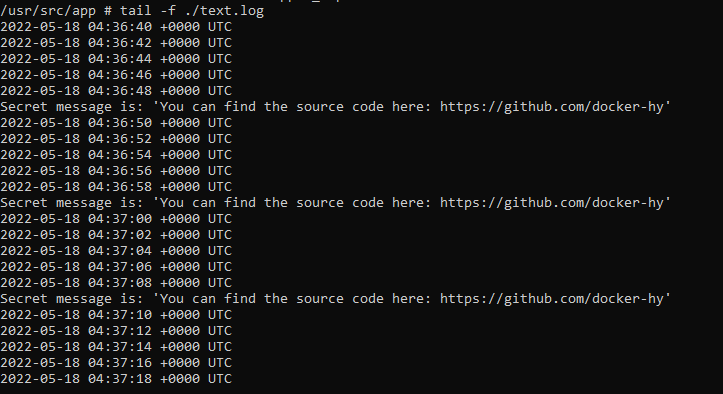

# Exercise 1.5: Sizes of images

In a previous exercise we used devopsdockeruh/simple-web-service:ubuntu.

Here is the same application but instead of ubuntu is using alpine: devopsdockeruh/simple-web-service:alpine.

Pull both images and compare the image sizes. Go inside the alpine container and make sure the secret message functionality is the same. Alpine version doesn't have bash but it has sh.

### Steps

- docker pull devopsdockeruh/simple-web-service:alpine
- docker image ls

### Results

### Steps

- docker run --name lopper_alpine devopsdockeruh/simple-web-service:alpine
- docker exec -it lopper_alpine sh
- tail -f ./text.log

### Results

