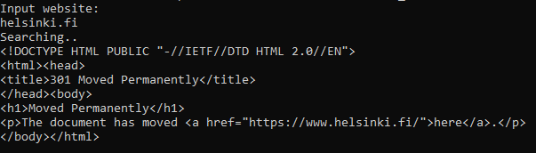

# Exercise 1.8: Image for script

We can improve our previous solutions now that we know how to create and build a Dockerfile.

Create a new file on your local machine with and append the script we used previously into that file

    echo "Input website:"; read website; echo "Searching.."; sleep 1; curl http://$website;

Create a Dockerfile for a new image that starts from ubuntu:20.04 and add instructions to install curl into that image. Then add instructions to copy the script file into that image and finally set it to run on container start using CMD.

After you have filled the Dockerfile, build the image with the tag "curler".

    If you are getting permission denied, use chmod to give permission to run the script.

The following should now work:

    $ docker run -it curler

    Input website:
    helsinki.fi
    Searching..
    <!DOCTYPE HTML PUBLIC "-//IETF//DTD HTML 2.0//EN">
    <html><head>
    <title>301 Moved Permanently</title>
    </head><body>
    <h1>Moved Permanently</h1>
    
The document has moved <a href="https://www.helsinki.fi/">here</a>.

    </body></html>

Submit the Dockerfile.

### Steps

- Create script.sh
- Create Dockerfile
- docker build . -t curler
- docker run -it curler

### Results

